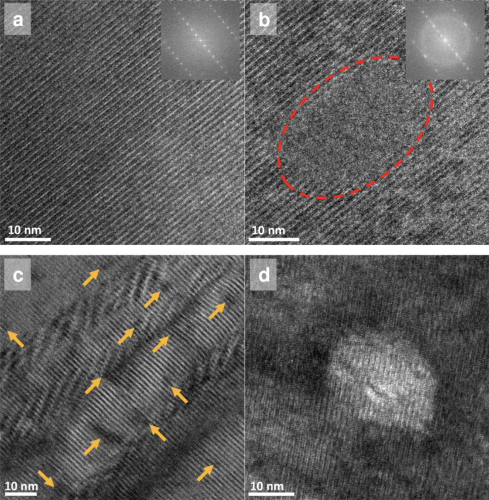

# Felix's Works and Collaborations
**UC Berkeley**  
[C. Reis, E. Kinyon, M. Martel, Y. Hu, F. Pat, et al., “The Effects of Fission vs Fusion-like Neutron Spectra on REBCO Activation and Microstructure,” Preprint (2025)](https://www.researchsquare.com/article/rs-8888914/v1)
  
REBCO-based superconducting magnets are considered crucial to the long-awaited realization of commercially viable controlled thermonuclear fusion via compact reactor architectures. To expand the current understanding of how the inherently reduced shielding of these proposed designs affects the radiation-sensitive high temperature superconductors, the activation spectra and microstructure of REBCO tapes irradiated more traditionally with fission-reactor neutrons were compared to those irradiated with the higher-fidelity fusion-like spectrum produced by thick target deuteron breakup in a first-of-its-kind irradiation experiment on these coated conductors. For the fusion-like case, several peaks in the activation spectrum confirmed high-threshold nuclear reactions, and SEM revealed superficial alterations to the most intensely irradiated area. TEM revealed that although both sets of microstructures appeared strained, the 14 MeV-irradiated damage manifested as milder patches of subcascades and large voids, with no large amorphous clusters classically associated with REBCO fission irradiations, as confirmed by our own fission samples. Computational analysis on the visually indistinguishable respective lattice strains revealed comparable damage metrics of the fusion-like samples to fission samples, despite the much lower total fluences on the former. The nuclear physics origins of these findings and their implications for the superconducting properties are also discussed. These results present an important preliminary step in the rigorous technical readiness qualifications required by this pivotal technology in the burgeoning REBCO-based compact fusion industry.

**NSF's NOIRLab**  
[F. Pat et al., “Reconstructing and Classifying SDSS DR16 Galaxy Spectra with Machine-Learning and Dimensionality Reduction Algorithms,” ASP Conference Series Vol. 525 (2022).](https://www.aspbooks.org/publications/525/067.pdf)
  
Optical spectra of galaxies and quasars from large cosmological surveys are used to measure redshifts and infer distances. They are also rich with information on the intrinsic properties of these astronomical objects. However, their physical interpretation can be challenging due to the substantial number of degrees of freedom, various sources of noise, and degeneracies between physical parameters that cause similar spectral characteristics. To gain deeper insights into these degeneracies, we apply two unsupervised machine learning frameworks to a sample from the Sloan Digital Sky Survey data release 16 (SDSS DR16). The first framework is a Probabilistic AutoEncoder (PAE), a two-stage deep learning framework consisting of a data compression stage from 1000 elements to 10 parameters and a density estimation stage. The second framework is a Uniform Manifold Approximation and Projection (UMAP), which we apply to both the uncompressed and compressed data. Exploring across regions on the compressed data UMAP, we construct sequences of stacked spectra which show a gradual transition from star-forming galaxies with narrow emission lines and blue spectra to passive galaxies with absorption lines and red spectra. Focusing on galaxies with broad emission lines produced by quasars, we find a sequence with varying levels of obscuration caused by cosmic dust. The experiments we present here inform future applications of neural networks and dimensionality reduction algorithms for large astronomical spectroscopic surveys.  

Tutorials for galaxy spectra analysis  
[Intro to Spectroscopy from the GOGREEN DR2 Dataset](https://github.com/astro-datalab/notebooks-latest/blob/master/03_ScienceExamples/GOGREEN_GalaxiesInRichEnvironments/4_GOGREENDr2Spec1DRedshift.ipynb)  
  
This notebook aims to illustrate 1D and 2D spectrum emission line features and how to derive the redshift and equivalent width of the [O II]3727 doublet from a Gaussian fit. Additionally, it shows how to display a galaxy image, plot its 1D and 2D spectrum, and fit the emission line to calculate the redshift and equivalent width to compare to the GOGREEN database values.

**CERN, ATLAS Collaboration**  
[Performance of Boosted Z Boson Tagger Using Unsupervised Learning in ATLAS](https://repository.arizona.edu/handle/10150/668692)
  
To detect and explore possible candidates for dark matter and physics beyond the Standard Model (BSM),
we use ATLAS’s recently developed Unified Flow Objects (UFOs) large-radius jets for tagging boosted
hadronic decays of the 𝑍0 boson (𝑍′)1. For the 𝑍′ tagger, we introduce the Clustering Autoencoder (CAE)
which integrates two unsupervised learning frameworks for the classification and mass decorrelation of
UFO jets. The first framework is a fully-connected autoencoder (AE) that reduces the number of input jet
substructure variables into a latent space of three dimensions, and the second framework is a Uniform
Manifold Approximation and Projection (UMAP) algorithm which reduces the AE latent space further
to two dimensions. Afterwards, a neural network score is constructed by transforming the UMAP latent
space to a histogram as a function of each event’s representative Euclidean space. We compare the CAE
tagger performance to previous cut-based tagger and deep neural network (DNN) tagger performances
through signal efficiency and background rejection rates. Though the 𝑍′ tagger underperforms tenfold
compared to previously tested taggers, the CAE presents a realistic approach of training without the UFO
jets’ weights and labels. Most importantly, the tagger we present here shows an important step towards
scaling into high dimension analysis for physics BSM.
